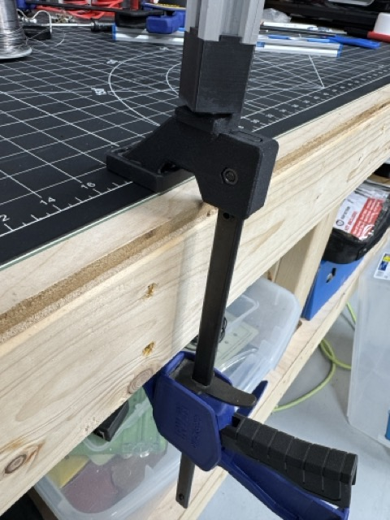

# Alternative Base for IRWIN QUICK-GRIP Clamps

I got tired of fighting with the c-clamp base that is included in the project, so I designed this to be installed on an Irwin brand Quick-Grip clamp.

## Parts to Buy

These clamps are fairly ubiquitous here in the US, available for sale at most major home improvement/hardware stores or on Amazon.

## How to Print

### Filament Type

I used PETG-CF, but you shouldn't need anything fancy. PLA or PETG will also work.

### Print Settings

Because of the cantilevered clamping force, you will need a fairly strong print. The model should already be oriented in the correct position. This has been working well for me:

- **Walls**: 5
- **Infill**: 50%
- **Infill Type**: Adaptive Cubic
- **Supports**: Optional\*

(\*) You might opt to enable supports if you find that the bridges are not as clean as you'd like. If you look closely at the picture, mine are drooping a bit, but it doesn't bother me.

## Assembly

It's super straight-forward, but for the sake of thoroughness:

1. Use a #2 Phillips screwdriver to remove the old clamp head.
2. Remove the rubber grip pad from the old clamp head and save it for re-use.
3. Install your fancy DIYson base clamp head.
4. Install the rubber grip pad.
5. Install the 40mm aluminum spacer that is used as the spindle for the lamp. I had to tap mine in with a mallet.
6. Enjoy your easily movable DIYson Express 🤙

Many thanks for Steven's work on this project. It's been great to follow on YouTube and I've been enjoying using the lamp.
